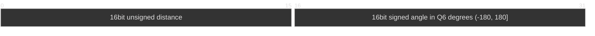

# Rx Frame
|command | code | ack |
|---|---| ---|
| device ready | -        | "DEVICE READY\0"|
|get status| 0xAA 0xA1| -|
|start scan| 0xAA 0xA2| "SRT SCAN ACK\0"|
|end scan  | 0xAA 0xA3| "END SCAN ACK\0"|

# Tx Frame
|Start of Frame (16bit)  | payload Length (16bit) | CRC (8bit)|Type (8bit)|timestamp (32bit) |  payload   | 
|---| ---|---|---|---|---|
|0xAA55|-|-| 0x00  system| -|system message | 
|0xAA55|-|-| 0x01  Lidar |-| point data| 
|0xAA55|-|-| 0x02  IMU | -|kinematic data| 
|0xAA55|-|-| 0x03  Encoder |-| odometry data| 

※ payload size is a multiple of 8 bit  

### System Message
TODO

### Lidar Frame payload 
size: 8 Byte * point number

The angle value is degrees multiplied by 64; for example, 45.5° is 2912.
Positive angles rotate clockwise from the LiDAR's zero direction. 180° is 11520,
while 180.015625° wraps to -11519.

### IMU Frame payload 
TODO

### Encoder Frame payload 
TODO

### CRC
|||
|---|---|
| Generator  |  CRC-8|
| CRC Width|  7bit |
| CRC Byte Field[7] | reserved |
| CRC Byte Field[6:0] | CRC |
