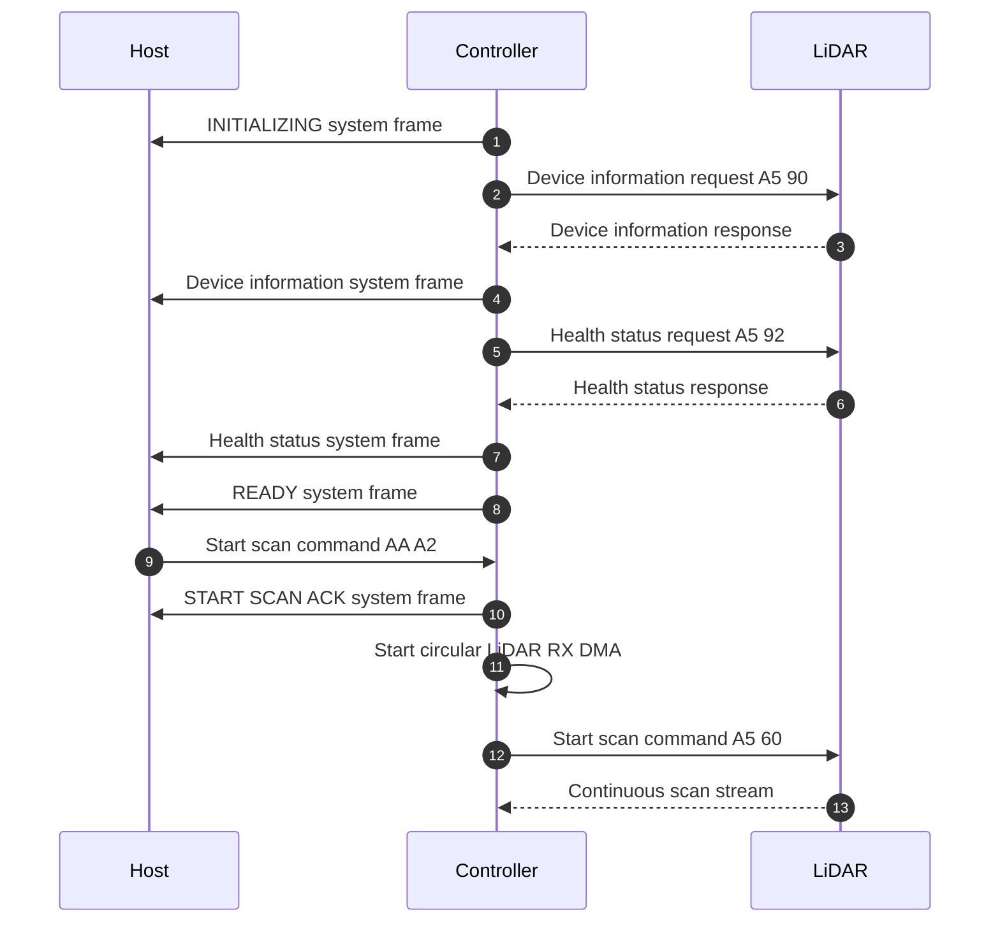
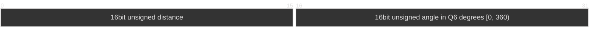

# Startup Sequence

Startup uses blocking UART transfers. Scan data uses DMA after the host sends the
start scan command.

The controller requests device information and health status while the LiDAR is
idle. The LiDAR manual allows only the stop command during scanning. RX DMA
starts before `A5 60`, so the controller can receive the first scan bytes.
The controller sends `START SCAN ACK` after it accepts the host command and
before it starts RX DMA. The ACK confirms the host command only. It does not
confirm DMA startup, the `A5 60` UART transfer, or a LiDAR response.

If UART communication or reply validation fails, the controller sends a
`STARTUP FAILED` system frame and does not start scanning.

## Host-to-Controller Commands

Each command is exactly two bytes and has no terminator.

| Command | Code |
|---|---|
| Start scan | `0xAA 0xA2` |

# Tx Frame
|Start of Frame (16bit)  | payload Length (16bit) | CRC (8bit)|Type (8bit)|timestamp (32bit) |  payload   | 
|---| ---|---|---|---|---|
|0xAA55|-|-| 0x01  Lidar |-| point data| 
|0xAA55|-|-| 0x02  IMU | -|kinematic data| 
|0xAA55|-|-| 0x03  Encoder |-| odometry data| 
|0xAA55|-|-| 0x04  Initializing |-| `INITIALIZING` |
|0xAA55|-|-| 0x05  Device information |-| Device information message |
|0xAA55|-|-| 0x06  Health status |-| Health status message |
|0xAA55|-|-| 0x07  Ready |-| `READY` |
|0xAA55|-|-| 0x08  Startup failed |-| `STARTUP FAILED` |
|0xAA55|-|-| 0x09  Start scan acknowledged |-| `START SCAN ACK` |

The header is 10 bytes. The start-of-frame bytes are `0xAA 0x55`; payload length
and timestamp are big-endian. The payload begins at `tx_buf + 10`, so it can
be written before the header. Payload length counts payload bytes only.
The timestamp is the controller's millisecond tick when the frame is built.

### System Message

System message types start at `0x04`; type `0x00` is not used. Their payloads are
ASCII text without a line terminator or NUL byte. The payload starts immediately
after the 10-byte TX header. The header payload length marks the message end.

| Type | Event | Host system message payload |
|---|---|---|
| `0x04` | Startup begins | `INITIALIZING` |
| `0x05` | Device information | `LiDAR DEVICE: model=N firmware=M.m hardware=H serial=XXXXXXXXXXXXXXXXXXXXXXXXXXXXXXXX` |
| `0x06` | Health, status byte `0x00` | `LiDAR STATUS: OK \| code=0x00` |
| `0x06` | Health, status byte above `0x00` | `LiDAR STATUS: FAULT \| code=0xNN` |
| `0x07` | Startup completes | `READY` |
| `0x08` | Startup fails | `STARTUP FAILED` |
| `0x09` | Host start command accepted | `START SCAN ACK` |

The health status is `FAULT` when any bit in the status byte is set. `NN` is the
two-digit uppercase hexadecimal status byte. The device serial is the 16 raw
serial-number bytes in sensor wire order, encoded as 32 uppercase hexadecimal
digits. Model, firmware, and hardware values are unsigned decimal numbers.

### LiDAR frame payload

Size: 4 bytes per point (2 bytes for distance and 2 bytes for angle).

The angle value is degrees multiplied by 64; for example, 45.5° is 2912.
Angles rotate clockwise from the LiDAR's zero direction. The encoded range is
0..23039; 360° wraps to zero.

The RX ring and TX queue design are described in [protocol.md](protocol.md).

### IMU Frame payload 
TODO

### Encoder Frame payload 
TODO

### CRC
The CRC field uses the 8-bit `crc_8()` function from libcrc. For now, its input
is only the two payload-length bytes at header offsets 2 and 3. Process each
byte most-significant bit first and write the full 8-bit result at offset 4.
The CRC does not currently cover the other header fields or the payload.
LiDAR RX checks are described in [protocol.md](protocol.md#data-checks).

| Parameter | Value |
|---|---|
| Width | 8 bits |
| Polynomial | `x^8 + x^5 + x^4 + 1`, represented as `0x31` without the top bit |
| Initial value | `0x00` |
| Input and output reflection | None |
| Final XOR | `0x00` |
| Check value for ASCII `123456789` | `0xA2` |
