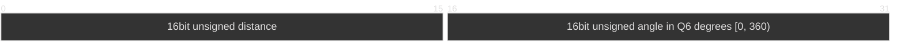

# Rx Frame
|command | code | ack |
|---|---| ---|
| device ready | -        | "DEVICE READY\0"|
|get status| 0xAA 0xA1| -|
|start scan| 0xAA 0xA2| "SRT SCAN ACK\0"|
|end scan  | 0xAA 0xA3| "END SCAN ACK\0"|

# Tx Frame
|Start of Frame (16bit)  | payload Length (16bit) | CRC (8bit)|Type (8bit)|timestamp (32bit) |  payload   | 
|---| ---|---|---|---|---|
|0xAA55|-|-| 0x00  system| -|system message | 
|0xAA55|-|-| 0x01  Lidar |-| point data| 
|0xAA55|-|-| 0x02  IMU | -|kinematic data| 
|0xAA55|-|-| 0x03  Encoder |-| odometry data| 

The header is 10 bytes. The start-of-frame bytes are `0xAA 0x55`; payload length
and timestamp are big-endian. The payload begins at `tx_buf + 10`, so it can
be written before the header. Payload length counts payload bytes only.

### System Message
TODO

### Lidar Frame payload 
size: 8 Byte * point number

The angle value is degrees multiplied by 64; for example, 45.5° is 2912.
Angles rotate clockwise from the LiDAR's zero direction. The encoded range is
0..23039; 360° wraps to zero.

### IMU Frame payload 
TODO

### Encoder Frame payload 
TODO

### CRC
The CRC field uses an 8-bit CRC. Process each byte most-significant bit first.
The CRC covers the full frame in wire order, including the payload, but skips
the CRC byte at header offset 4. Write the full 8-bit remainder into that byte.

| Parameter | Value |
|---|---|
| Width | 8 bits |
| Polynomial | `x^8 + x^2 + x + 1`, represented as `0x07` without the top bit |
| Initial value | `0x00` |
| Input and output reflection | None |
| Final XOR | `0x00` |
| Check value for ASCII `123456789` | `0xF4` |
