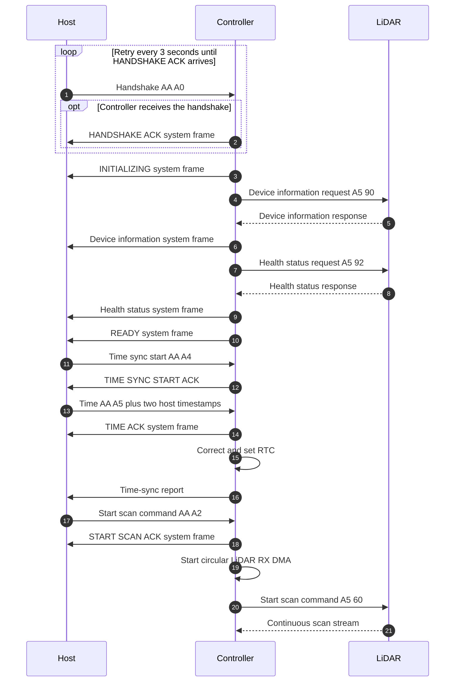
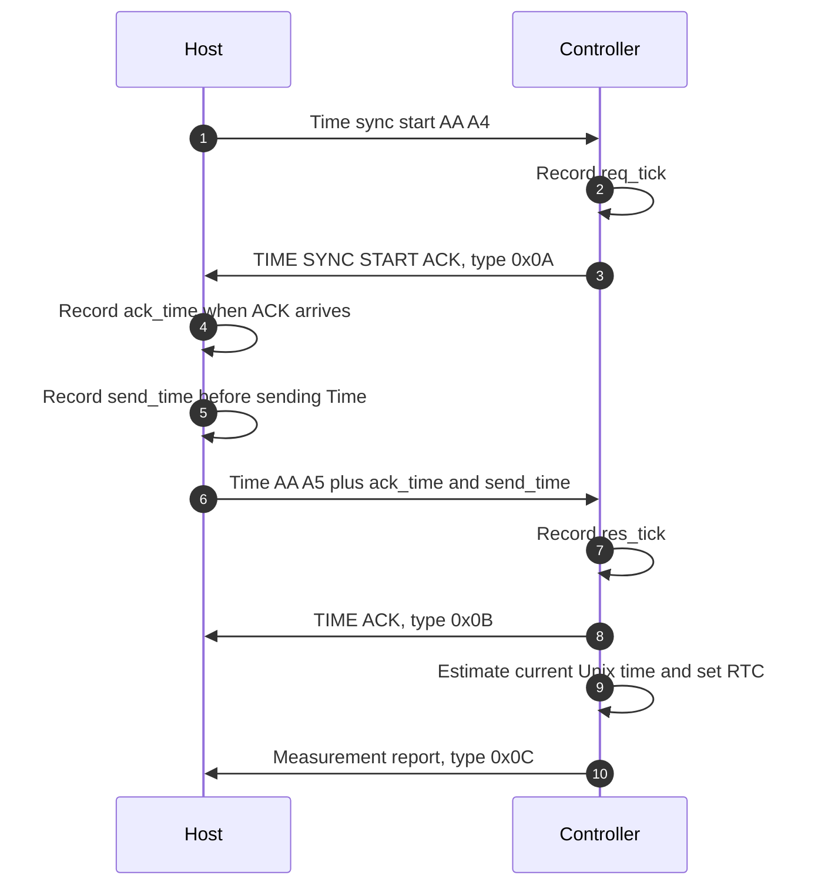
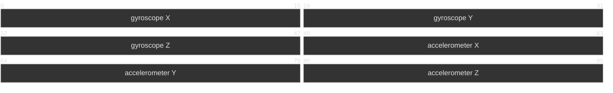

# Startup Sequence

Startup uses blocking UART transfers. Scan data uses DMA after the host sends the
start scan command.

The host sends a handshake every 3 seconds until it receives `HANDSHAKE ACK`.
Initialization starts after this exchange. For protocol errors and recovery,
see [protocol.md](protocol.md#connection-and-recovery).

Handshake, motor commands, and recovery are protocol requirements. Their
firmware handlers are not implemented yet.


```mermaid
sequenceDiagram
    autonumber
    participant Host
    participant Controller
    participant LiDAR

    loop Retry every 3 seconds until HANDSHAKE ACK arrives
        Host->>Controller: Handshake AA A0
        opt Controller receives the handshake
            Controller->>Host: HANDSHAKE ACK system frame
        end
    end
    Controller->>Host: INITIALIZING system frame
    Controller->>LiDAR: Device information request A5 90
    LiDAR-->>Controller: Device information response
    Controller->>Host: Device information system frame
    Controller->>LiDAR: Health status request A5 92
    LiDAR-->>Controller: Health status response
    Controller->>Host: Health status system frame
    Controller->>Host: READY system frame
    Host->>Controller: Time sync start AA A4
    Controller->>Host: TIME SYNC START ACK
    Host->>Controller: Time AA A5 plus two host timestamps
    Controller->>Host: TIME ACK system frame
    Controller->>Controller: Correct and set RTC
    Controller->>Host: Time-sync report
    Host->>Controller: Start scan command AA A2
    Controller->>Host: START SCAN ACK system frame
    Controller->>Controller: Start circular LiDAR RX DMA
    Controller->>LiDAR: Start scan command A5 60
    LiDAR-->>Controller: Continuous scan stream
```

The controller requests device information and health status while the LiDAR is
idle. The LiDAR manual allows only the stop command during scanning. RX DMA
starts before `A5 60`, so the controller can receive the first scan bytes.
The controller sends `START SCAN ACK` after it accepts the host command and
before it starts RX DMA. The ACK confirms the host command only. It does not
confirm DMA startup, the `A5 60` UART transfer, or a LiDAR response.

If UART communication or reply validation fails, the controller sends a
`STARTUP FAILED` system frame when possible and returns to the handshake stage.
The host retries the handshake, then repeats startup and time synchronization
before starting a new scan.

## Host-to-Controller Commands

These messages have no terminator. Handshake, Start scan, and Time sync start
are two-byte commands. Time appends two timestamps. Motor control uses the same
10-byte frame header and 4-byte payload as an encoder frame.

The controller accepts `Time` only after it has acknowledged `Time sync start`.
It accepts motor commands only during normal communication.

| Message | Wire data | Size |
|---|---|---:|
| Handshake | `0xAA 0xA0` | 2 bytes |
| Start scan | `0xAA 0xA2` | 2 bytes |
| Time sync start | `0xAA 0xA4` | 2 bytes |
| Time | `0xAA 0xA5`, ACK receive time, and Time send time | 18 bytes |
| Motor control | `0xAA 0x55` frame, type `0x03`, left and right Q6 rotations | 14 bytes |

`Handshake` is a connection request, not a heartbeat. The host stops its
3-second retry loop after `HANDSHAKE ACK`.

### Motor control

The host sends the same frame layout used for encoder reports:

- Direction: host to controller
- Header: 10 bytes, as defined in [Tx Frame](#tx-frame)
- Type: `0x03`
- Payload length: `4`
- Payload: left wheel first, then right wheel; 16-bit Q6 rotations, little-endian
- Unit: `rotations`, matching [Encoder Frame payload](#encoder-frame-payload)
- Timestamp: the host's millisecond tick when it builds the frame
- CRC: the same payload-length check as other frames

Direction gives the frame its meaning: host to controller carries requested
wheel rotations; controller to host carries measured encoder rotations.

```text
                    HOST -> CONTROLLER: MOTOR CONTROL
byte offset   0       2       4    5        6             10       12       14
              |-------|-------|----|--------|-------------|--------|--------|
              | AA 55 | 04 00 | CRC| type 03| timestamp   | left Q6|right Q6|
              |-------|-------|----|--------|-------------|--------|--------|
              <----------- 10-byte header -------------><-- 4-byte data -->
```

For left `12.5` rotations and right `7.25` rotations, the payload is
`20 03 D0 01`, exactly as in the encoder example. The payload carries rotation
counts; it does not carry RPM or rotations per second.

### Time command

After `0xAA 0xA4`, the controller records `req_tick` and replies with
`TIME SYNC START ACK`. The host records `ack_time` when it receives that ACK.
Immediately before sending the Time frame, the host records `send_time`. Both
values are unsigned 64-bit Unix timestamps in milliseconds. The controller
records `res_tick` as soon as the complete 18-byte frame arrives, verifies the
command, and replies with `TIME ACK`.

The Time frame uses this byte layout:

| Byte offset | Size | Field | Format |
|---:|---:|---|---|
| `0` | 2 bytes | Command | `0xAA 0xA5` |
| `2` | 8 bytes | `ack_time` | Unsigned 64-bit Unix milliseconds, little-endian |
| `10` | 8 bytes | `send_time` | Unsigned 64-bit Unix milliseconds, little-endian |

The host performs this four-message exchange once. The controller uses the four
timestamps to set its RTC, then sends one time-sync report.

## Time Synchronization


```mermaid
sequenceDiagram
    autonumber
    participant Host
    participant Controller

    Host->>Controller: Time sync start AA A4
    Controller->>Controller: Record req_tick
    Controller->>Host: TIME SYNC START ACK, type 0x0A
    Host->>Host: Record ack_time when ACK arrives
    Host->>Host: Record send_time before sending Time
    Host->>Controller: Time AA A5 plus ack_time and send_time
    Controller->>Controller: Record res_tick
    Controller->>Host: TIME ACK, type 0x0B
    Controller->>Controller: Estimate current Unix time and set RTC
    Controller->>Host: Measurement report, type 0x0C
```

The controller removes host processing time from the controller-side round
trip. It assumes equal transmission time in both directions:

```text
controller_round_trip = res_tick - req_tick
host_processing       = send_time - ack_time
network_round_trip    = controller_round_trip - host_processing
time_at_res_tick      = send_time + network_round_trip / 2
current_unix_time     = time_at_res_tick + (current_tick - res_tick)
```

All differences are in milliseconds. The controller rejects a measurement if
the host clock moves backwards or `host_processing` is longer than
`controller_round_trip`. The RTC stores UTC calendar time from 2000 through
2099. Its subsecond shift register preserves the millisecond part at the RTC
prescaler resolution.

# Tx Frame
|Start of Frame (16bit)  | payload Length (16bit) | CRC (8bit)|Type (8bit)|timestamp (32bit) |  payload   | 
|---| ---|---|---|---|---|
|0xAA55|-|-| 0x01  Lidar |-| point data| 
|0xAA55|-|-| 0x02  IMU | -|kinematic data| 
|0xAA55|-|-| 0x03  Encoder |-| left and right wheel rotation data|
|0xAA55|-|-| 0x04  Initializing |-| `INITIALIZING` |
|0xAA55|-|-| 0x05  Device information |-| Device information message |
|0xAA55|-|-| 0x06  Health status |-| Health status message |
|0xAA55|-|-| 0x07  Ready |-| `READY` |
|0xAA55|-|-| 0x08  Startup failed |-| `STARTUP FAILED` |
|0xAA55|-|-| 0x09  Start scan acknowledged |-| `START SCAN ACK` |
|0xAA55|-|-| 0x0A  Time-sync start acknowledged |-| `TIME SYNC START ACK` |
|0xAA55|-|-| 0x0B  Time acknowledged |-| `TIME ACK` |
|0xAA55|-|-| 0x0C  Time-sync report |-| One time-sync measurement |
|0xAA55|-|-| 0x0D  Handshake acknowledged |-| `HANDSHAKE ACK` |

The header is 10 bytes. The start-of-frame marker is the fixed byte sequence
`0xAA 0x55`. Payload length and timestamp are little-endian. The payload begins
at `tx_buf + 10`, so it can be written before the header. Payload length counts
payload bytes only. For controller-to-host frames, the timestamp is the
controller's millisecond tick when the frame is built. Motor commands use the
host's millisecond tick. These ticks are local to each sender; they are not Unix
timestamps. CRC and type are one byte each and therefore have no byte order.

### System Message

System message types start at `0x04`; type `0x00` is not used. Their payloads are
ASCII text without a line terminator or NUL byte. The payload starts immediately
after the 10-byte TX header. The header payload length marks the message end.

| Type | Event | Host system message payload |
|---|---|---|
| `0x04` | Startup begins | `INITIALIZING` |
| `0x05` | Device information | `LiDAR DEVICE: model=N firmware=M.m hardware=H serial=XXXXXXXXXXXXXXXXXXXXXXXXXXXXXXXX` |
| `0x06` | Health, status byte `0x00` | `LiDAR STATUS: OK \| code=0x00` |
| `0x06` | Health, status byte above `0x00` | `LiDAR STATUS: FAULT \| code=0xNN` |
| `0x07` | Startup completes | `READY` |
| `0x08` | Startup fails | `STARTUP FAILED` |
| `0x09` | Host start command accepted | `START SCAN ACK` |
| `0x0A` | Time-sync start command accepted | `TIME SYNC START ACK` |
| `0x0B` | One Unix-time sample accepted | `TIME ACK` |
| `0x0C` | Time synchronization completed | Time-sync measurement report |
| `0x0D` | Handshake received | `HANDSHAKE ACK` |

A time-sync report is one ASCII payload ending with `\r\n`:

```text
TIME SYNC: samples=1 | #1 req_tick=N ms res_tick=N ms round_trip=N ms ack_time=N ms send_time=N ms\r\n
```

`req_tick` is captured before the controller sends `TIME SYNC START ACK`.
`ack_time` is captured by the host when that ACK arrives. `send_time` is captured
by the host immediately before it sends the Time frame. `res_tick` is captured
by the controller immediately after the complete Time frame arrives. Unsigned
subtraction gives `round_trip = res_tick - req_tick`, including across one
tick-counter wrap. The host processing interval is `send_time - ack_time`.

The health status is `FAULT` when any bit in the status byte is set. `NN` is the
two-digit uppercase hexadecimal status byte. The device serial is the 16 raw
serial-number bytes in sensor wire order, encoded as 32 uppercase hexadecimal
digits. Model, firmware, and hardware values are unsigned decimal numbers.


### LiDAR frame payload

Size: 4 bytes per point (2 bytes for distance and 2 bytes for angle). The
distance field comes first, followed by the angle field. Each 16-bit field is
little-endian on the wire: its least-significant byte is transmitted first.


```mermaid
%%{init: {'theme': 'dark'}}%%

packet
+8: "distance low byte"
+8: "distance high byte"
+8: "angle Q6 low byte"
+8: "angle Q6 high byte"
```

The angle value is degrees multiplied by 64; for example, 45.5° is 2912.
Angles rotate clockwise from the LiDAR's zero direction. The encoded range is
0..23039; 360° wraps to zero.

For example, a point at distance 7161 (`0x1BF9`) and angle 10°
(`10 * 64 = 640 = 0x0280`) is transmitted as:

| Byte offset | `0` | `1` | `2` | `3` |
|---:|---:|---:|---:|---:|
| Wire byte | `F9` | `1B` | `80` | `02` |
| Field | distance low | distance high | angle low | angle high |

The same little-endian order is used by the payload length and timestamp in the
frame header. All currently defined multi-byte numeric fields in the host frame
are therefore little-endian.

The RX ring is described in [protocol.md](protocol.md). The TX queue and slot
lifecycle are described in [tx.md](tx.md).


### IMU frame payload

The controller sends the IMU sample buffer directly as the payload.

- Payload size: 12 bytes
- Field order: sensor register order starting at `OUTX_L_G`
- Value format: raw 16-bit two's-complement sample
- Byte order: little-endian; low register byte first
- Unit: sensor LSB
- Conversion: none; the host applies the configured full-scale sensitivity


```mermaid
%%{init: {'theme': 'dark'}}%%

packet
+16: "gyroscope X"
+16: "gyroscope Y"
+16: "gyroscope Z"
+16: "accelerometer X"
+16: "accelerometer Y"
+16: "accelerometer Z"
```

| Byte offset | Size | Sample | Unit |
|---:|---:|---|---|
| `0` | 2 bytes | Gyroscope X | LSB |
| `2` | 2 bytes | Gyroscope Y | LSB |
| `4` | 2 bytes | Gyroscope Z | LSB |
| `6` | 2 bytes | Accelerometer X | LSB |
| `8` | 2 bytes | Accelerometer Y | LSB |
| `10` | 2 bytes | Accelerometer Z | LSB |

The host can convert gyroscope samples to `dps` and accelerometer samples to
`g` when physical units are needed.

### Encoder Frame payload

Direction: controller to host, type `0x03`. Motor commands reuse this layout in
the opposite direction.

Size: 4 bytes per sample. The left wheel value comes first, followed by the
right wheel value. Each value is a 16-bit Q6 wheel rotation count and uses the
same little-endian byte order as the other multi-byte host-frame fields.

| Payload offset | Field | Size | Format | Unit | Byte order |
|---:|---|---:|---|---|---|
| `0` | Left wheel rotation count | 2 bytes | 16-bit Q6 | rotations | little-endian |
| `2` | Right wheel rotation count | 2 bytes | 16-bit Q6 | rotations | little-endian |


```mermaid
%%{init: {'theme': 'dark'}}%%

packet
+8: "left Q6 low byte"
+8: "left Q6 high byte"
+8: "right Q6 low byte"
+8: "right Q6 high byte"
```

Divide the encoded value by 64 to get the wheel rotation count:

\[
\text{wheel rotations} = \frac{\text{Q6 value}}{64}
\]

For example, left wheel `12.5` rotations and right wheel `7.25` rotations are
encoded as `12.5 * 64 = 800 = 0x0320` and
`7.25 * 64 = 464 = 0x01D0`:

| Byte offset | `0` | `1` | `2` | `3` |
|---:|---:|---:|---:|---:|
| Wire byte | `20` | `03` | `D0` | `01` |
| Field | left low | left high | right low | right high |

### CRC
The CRC field uses the 8-bit `crc_8()` function from libcrc. For now, its input
is only the two payload-length bytes at header offsets 2 and 3. Process each
byte most-significant bit first and write the full 8-bit result at offset 4.
The CRC does not currently cover the other header fields or the payload.
LiDAR RX checks are described in [protocol.md](protocol.md#data-checks).

| Parameter | Value |
|---|---|
| Width | 8 bits |
| Polynomial | `x^8 + x^5 + x^4 + 1`, represented as `0x31` without the top bit |
| Initial value | `0x00` |
| Input and output reflection | None |
| Final XOR | `0x00` |
| Check value for ASCII `123456789` | `0xA2` |
