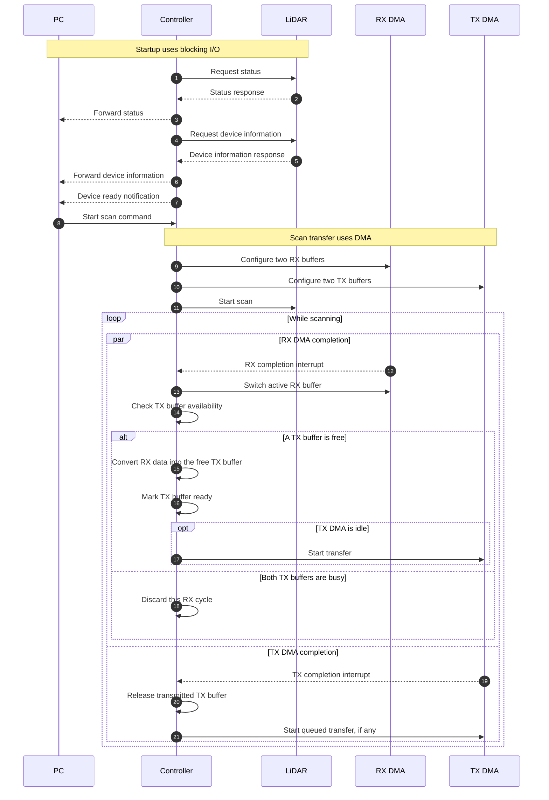
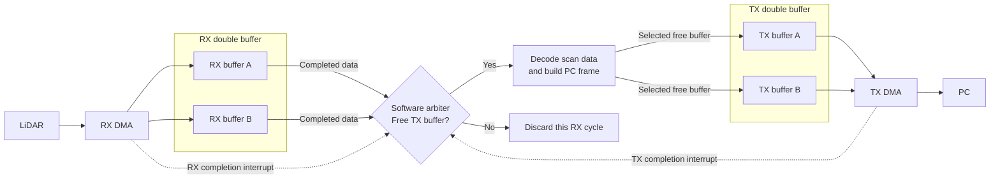

# Startup and Scan Data Flow

This page describes the planned startup sequence and scan data path. Startup uses blocking I/O. After the PC sends the start scan command, the controller configures DMA double buffers and starts the LiDAR.

RX carries data from the LiDAR to the controller. TX carries data from the controller to the PC.

## Startup sequence

## Buffer ownership and data path

The software arbiter tracks which RX buffer has completed and whether each TX buffer is free, queued, or transmitting. The two DMA completion interrupts can arrive in either order. Solid arrows show data movement; dashed arrows show completion interrupts.

If one TX buffer is transmitting and the other is queued, neither is available. The arbiter discards the completed RX data for that cycle. It does not retry the discarded data; the next completed RX buffer is considered for transfer. After conversion or discard, the completed RX buffer becomes available for reuse.

A TX completion releases the transmitted buffer and starts a queued transfer when one exists.

For PC commands and frame formats, see [frame.md](frame.md). These diagrams describe the intended design, not the current implementation status.
