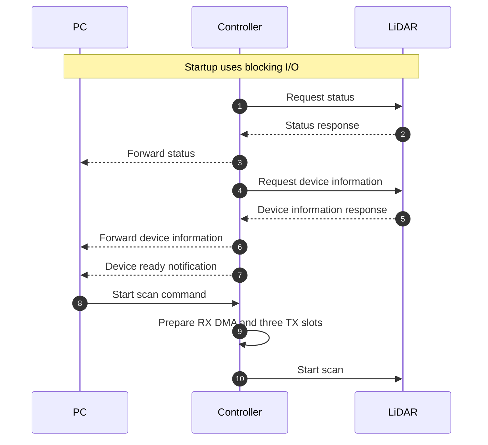
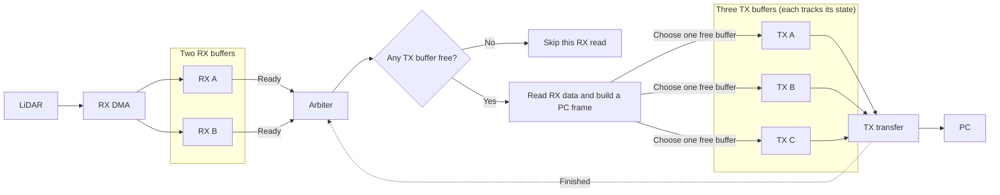

# Startup and Scan Data Flow

This page describes the planned startup and scan data path. Startup uses
blocking I/O. During scanning, RX DMA receives LiDAR bytes and TX DMA sends
PC frames. The buffer and throughput estimates below cover LiDAR data only.

## Startup sequence



## Scan-time DMA arbitration

RX and TX events can arrive in either order. When RX data becomes ready,
the arbiter checks the three TX buffers before reading it. If a TX buffer
is free, the controller reads the RX data and builds a PC frame. If all
three TX buffers are busy, it skips that RX read. A LiDAR packet may cross
an RX buffer boundary.



Only one free TX buffer is selected for each PC frame. Each TX buffer moves
through `free -> filling -> queued -> transmitting -> free`. USART2 owns a
transmitting buffer until the UART TX completion callback; the controller
must not write to it. TX DMA sends the actual frame length, not the entire
buffer.

If none of the three TX buffers is free, the arbiter does not read the newly
ready RX data. It records the skipped read and lets RX continue.
Since the skipped data may include only part of a LiDAR packet, parsing must
resume at the next valid packet header. Starting a TX transfer is a software
action; USART2 supplies the DMA requests that pace the individual bytes.

With HAL's normal-mode TX DMA, the DMA completion handler enables the USART2
transmit-complete (TC) interrupt. The USART2 interrupt handler must call
`HAL_UART_IRQHandler(&huart2)`. Release the slot in
`HAL_UART_TxCpltCallback`, after the final byte has left the UART.

## LiDAR TX buffer layout

The [LiDAR development manual](../YDLIDAR_T-MINI_PLUS_Development_Manual_with_TOC.pdf)
shows an `A5 5A` scan response header with continuous mode and type `0x81`.
Its content uses `AA 55` scan packets. The figures do not explicitly say whether
the response header can recur, so the parser accepts both a header before the
first packet and packets that arrive without one. The manual defines the sample
count (`LSN`) as one byte. A normal LiDAR scan packet has
10 fixed bytes plus 3 bytes per point, so its largest possible size is
`10 + 3 * 255 = 775` bytes. This is one packet, not one full rotation.

The PC LiDAR payload uses 4 bytes per point: a 16-bit distance and a 16-bit
Q6 angle. The 10-byte PC header makes the largest PC frame
`10 + 4 * 255 = 1030` bytes. Write the payload at the frame base plus
10 bytes, then write the header at the frame base.

The planned TX storage is one 4032-byte array divided into three 1344-byte
slots. A pointer to slot `i` is the array base plus `i * 1344`. The next
slot after slot 2 is slot 0.

```text
TX storage: 4032 bytes
+-----------------+-----------------+-----------------+
| slot 0: 1344 B  | slot 1: 1344 B  | slot 2: 1344 B  |
+-----------------+-----------------+-----------------+
0                1344              2688              4032

Largest frame in one slot: [header 10 B][255 points x 4 B][unused 314 B]
```

One complete PC frame occupies one slot, so neither the CPU writer nor TX
DMA needs to split that frame at a slot boundary. The slot index wraps when
it reaches 3. A slot becomes available again only after its UART TX
completion callback. The three slots absorb short bursts, but their number
does not increase the UART's sustained transfer rate.

## LiDAR-only throughput estimate

At the nominal ranging rate of 4000 points per second and a 10 Hz rotation
rate, one rotation contains about 400 points. The point payload is therefore
about `400 * 4 = 1600` bytes per 100 ms. At 230400 bps with 8N1 framing,
USART2 can send at most `230400 bits/s / 10 bits/byte * 0.1 s = 2304 bytes`
per 100 ms.
This leaves 704 bytes per 100 ms for the 10-byte PC header on each LiDAR
packet. For `P` LiDAR packets per rotation:

```text
1600 + 10 * P <= 2304 bytes per 100 ms
```

The theoretical limit is 70 LiDAR packets per rotation, with almost no
margin at that limit. Measure the actual packet count and queue occupancy
before treating 230400 bps as sufficient. Short bursts can fill the slots
even when the average data rate fits.

This is a design target. The current firmware still declares two 1024-byte
TX buffers and configures USART2 at 115200 bps; the new buffer layout and
baud rate have not been implemented yet. USART2 TX completion interrupts
must also be enabled. The current DMA configuration uses word-width transfers
for byte-oriented UART data, so its transfer width needs to be changed
before DMA-based scanning is used. RX DMA is currently in normal mode; it
must be restarted or configured for continuous reception.

For PC commands and frame formats, see [frame.md](frame.md).
