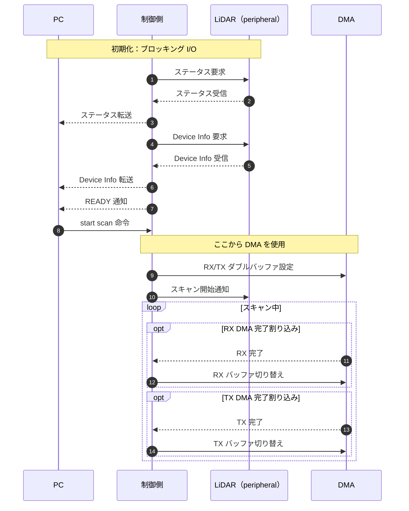

# 起動時の通信シーケンス

以下は起動からスキャン開始後までの設計上の流れ。ステータスと Device Info の取得・PC への転送、PC からの start scan 命令待ちはブロッキング I/O で行う。命令を受けた後に DMA の RX/TX ダブルバッファを設定し、LiDAR にスキャン開始を通知する。

PC 向けのコマンドと転送フレームの仕様は [frame.md](frame.md) を参照。この図は予定する処理順序を示し、現時点での実装完了を表すものではない。
