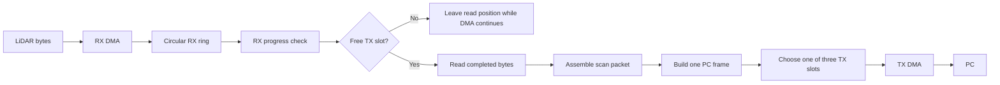
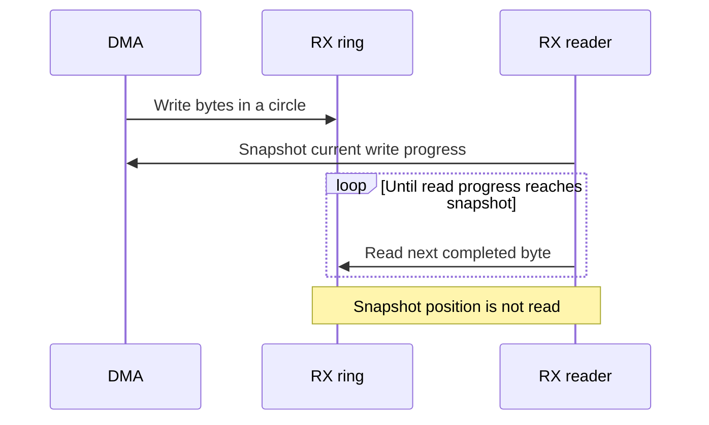
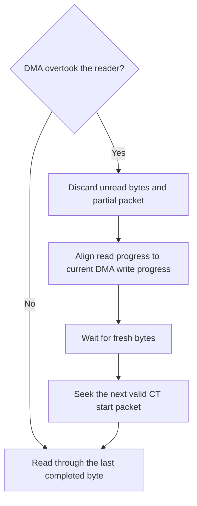
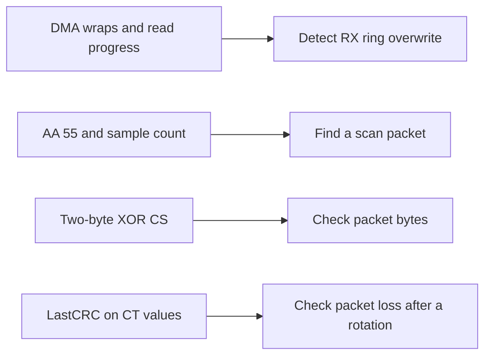

# Startup and Scan Data Flow

Startup uses blocking I/O. The scan path below plans circular RX DMA and
three TX slots for PC frames.

## Startup sequence


## Scan-time buffers and arbitration

The RX layer hides the ring base, capacity, CPU read progress, and DMA write
progress. Packet assembly requests a byte count and receives data.



If every TX slot is busy, the reader keeps its position. DMA keeps writing.
Each TX slot is `free -> filling -> queued -> transmitting -> free`; it is
released only after the final UART byte leaves.

## RX read and overrun recovery

The write position is the next DMA destination. The read position is the next
byte for the CPU. One read uses a fixed snapshot and stops before that write
position.



| DMA wraps minus reader wraps | Index test | State |
| --- | --- | --- |
| 0 | Write = read | Empty |
| 0 | Write > read | Unread bytes, no overwrite |
| 1 | Write < read | Unread bytes, no overwrite |
| 1 | Write = read | Full; next byte overwrites |
| 1 | Write > read | Unread bytes overwritten |
| 2 or more | Any | Unread bytes overwritten |

The two wrap counts only increase. These tests work for any ring capacity.
Take a consistent snapshot of DMA progress before comparing them.



Recovery uses new bytes at the current DMA position. It does not wait for
another RX ring wrap. Complete LiDAR rotations restart at the next CT start
packet.

## RX data checks

The [LiDAR development manual](../YDLIDAR_T-MINI_PLUS_Development_Manual_with_TOC.pdf)
defines a two-byte XOR `CS` for each scan packet. `LastCRC` is a CRC8 of the
previous rotation's CT bytes, carried before the next start packet.



Checksums do not replace the RX progress check. `LastCRC` is checked at the
next start packet. The [PC frame CRC](frame.md#crc) checks only the PC
payload-length field, not LiDAR RX bytes.
After overrun, the first start packet's `LastCRC` belongs to the discarded
rotation. The following start packet can check the new rotation.

## Frame and TX slot sizes

| Item | Largest size |
| --- | ---: |
| One LiDAR packet; one-byte LSN | `10 + 3 * 255 = 775` bytes |
| One PC LiDAR frame | `10 + 4 * 255 = 1030` bytes |
| One TX slot | 1344 bytes |

The three TX slots are slices of one 4032-byte array. The PC payload starts
10 bytes after the slot base; the header can be written afterward.

```text
TX storage: 4032 bytes
+-----------------+-----------------+-----------------+
| slot 0: 1344 B  | slot 1: 1344 B  | slot 2: 1344 B  |
+-----------------+-----------------+-----------------+
0                1344              2688              4032

Largest frame: [header 10 B][255 points x 4 B][unused 314 B]
```

One PC frame fits in one slot. Slots absorb bursts, but do not raise the
UART's sustained rate.

## Current code and planned path

| Part | Current code | Planned scan path |
| --- | --- | --- |
| RX storage | Two 2048-byte slots | One circular ring |
| UART4 RX DMA | Normal mode, word-width | Circular mode, byte-width |
| TX storage | Three 1344-byte slots | Same slots with state control |
| USART2 | 115200 bps | 230400 bps with TX DMA |
| LiDAR checks | Packet XOR and LastCRC not checked | Check both after assembly |

For PC commands and frame formats, see [frame.md](frame.md).
