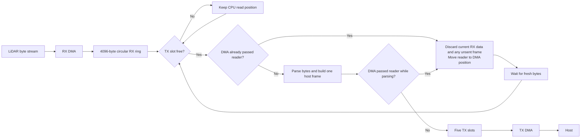
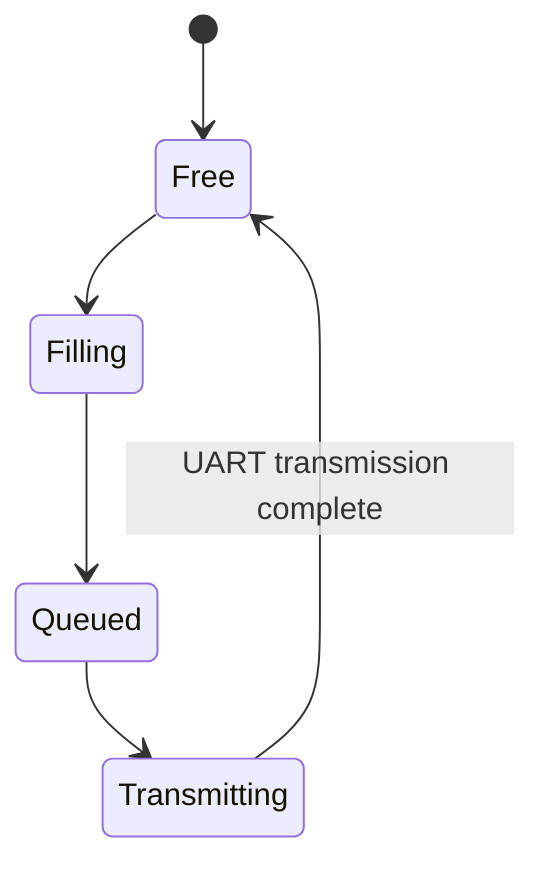
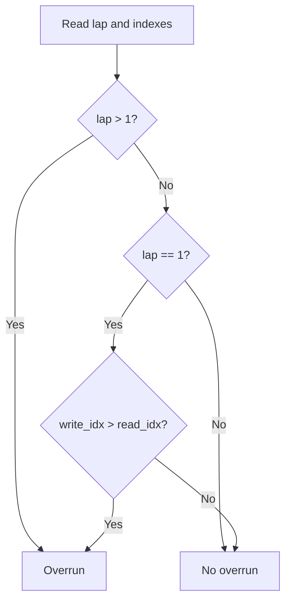
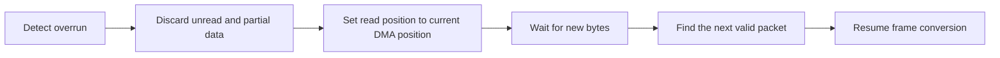
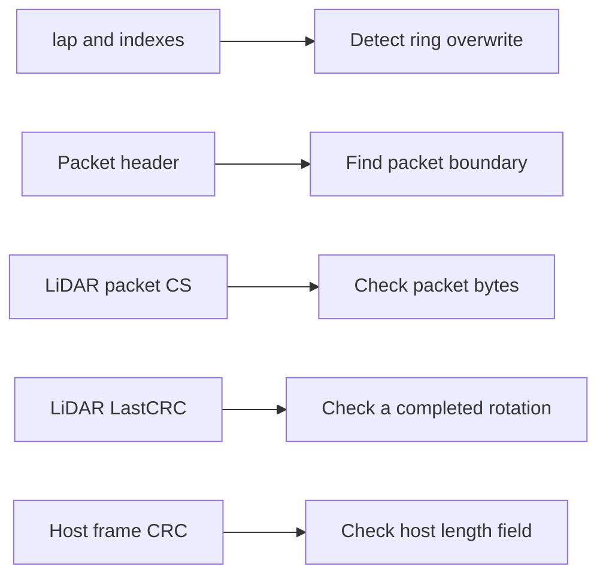

# Startup and Scan Data Flow

Startup uses blocking UART transfers. Scanning uses circular RX DMA and
software-started TX DMA.

## Startup

The startup order and host messages are defined in
[frame.md](frame.md#startup-sequence).

## Scan path



RX DMA continues while all TX slots are busy. The CPU read position stays
unchanged, so the next free-slot check can detect whether DMA passed it.

One host frame uses one TX slot. A slot follows this cycle:



The queue stores each slot as free or full. The UART state distinguishes a
queued full slot from the full slot currently being transmitted.

## RX ring positions

`write_idx` is the next DMA destination. `read_idx` is the next byte for the
CPU. The CPU never reads the current DMA destination.

```text
index       0                                             4095
            |-----------------------------------------------|
DMA         W -> next write
CPU                         R -> next read
```

`lap` is the number of DMA wraps that the reader has not crossed yet. DMA
increments it at the ring end. The reader decrements it when its index returns
to zero.

| `lap` | Index relation | Result |
| ---: | --- | --- |
| 0 | Any valid indexes | DMA has not passed the reader |
| 1 | `write_idx <= read_idx` | DMA has not passed the reader |
| 1 | `write_idx > read_idx` | DMA passed the reader |
| 2 or more | Any valid indexes | DMA passed the reader |



The indexes are signed values. This keeps `100 - 3500 = -3400` negative
after one DMA wrap instead of wrapping to a large unsigned value.

## Overrun recovery



Recovery starts from bytes that arrive after alignment. It does not wait for
another full ring wrap.

## Data checks



The ring position detects overwritten bytes. A checksum cannot replace that
check. LiDAR packet `CS` and `LastCRC` are future checks. The current host
CRC covers only the two payload-length bytes.

## Frame and TX storage sizes

| Item | Largest size |
| --- | ---: |
| One LiDAR packet with one-byte LSN | `10 + 3 * 255 = 775` bytes |
| One host LiDAR frame | `10 + 4 * 255 = 1030` bytes |
| One TX slot | 1344 bytes |

```text
TX storage: 6720 bytes
+-----------------+-----------------+-----------------+-----------------+-----------------+
| slot 0: 1344 B  | slot 1: 1344 B  | slot 2: 1344 B  | slot 3: 1344 B  | slot 4: 1344 B  |
+-----------------+-----------------+-----------------+-----------------+-----------------+
0                1344              2688              4032              5376              6720

Largest frame: [header 10 B][255 points x 4 B][unused 314 B]
```

One slot can be transmitting while four complete frames wait. The payload
arrays use 6720 bytes. The full queue object uses 6764 bytes after metadata
and alignment.

More slots absorb a short burst. They do not increase the sustained UART
rate. With 8N1 framing, the maximum payload rate is approximately
`baud rate / 10` bytes per second.

## LiDAR-only throughput at 230400 bps

| Quantity | Calculation | Result |
| --- | ---: | ---: |
| LiDAR point rate | configured ranging rate | 4000 points/s |
| Host point payload | `4000 * 4` | 16000 bytes/s |
| UART capacity with 8N1 | `230400 / 10` | 23040 bytes/s |
| Remaining capacity | `23040 - 16000` | 7040 bytes/s |

At a 6 Hz scan rate, one rotation carries about 667 points. Its host
point payload is about 2667 bytes, while the UART can send 3840 bytes in the
same interval. This leaves about 1173 bytes for 10-byte host headers, or a
theoretical maximum of 117 LiDAR packets per rotation. Actual packet count and
TX queue occupancy must be measured before using this limit.

For host commands and frame fields, see [frame.md](frame.md).
