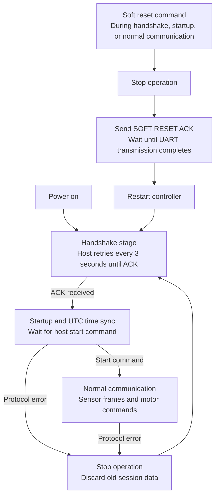
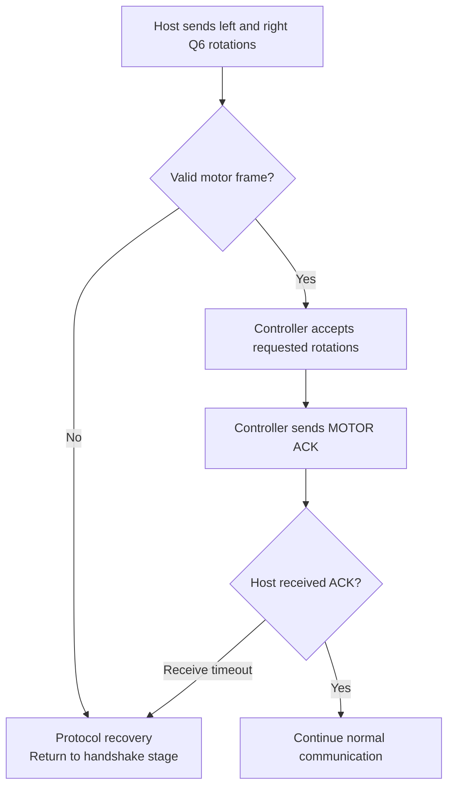
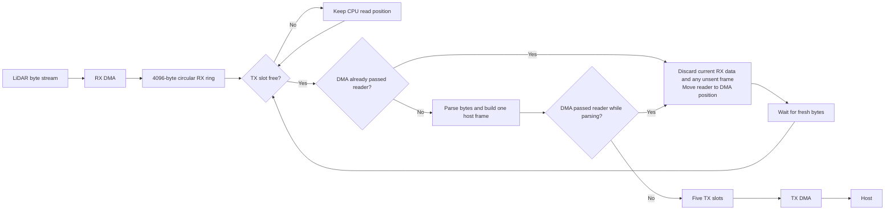
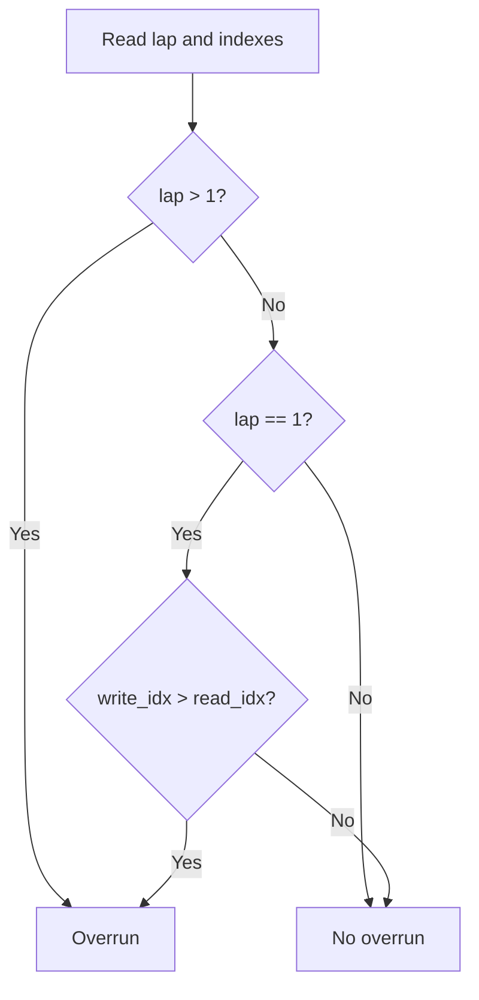
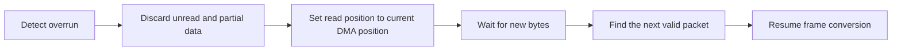
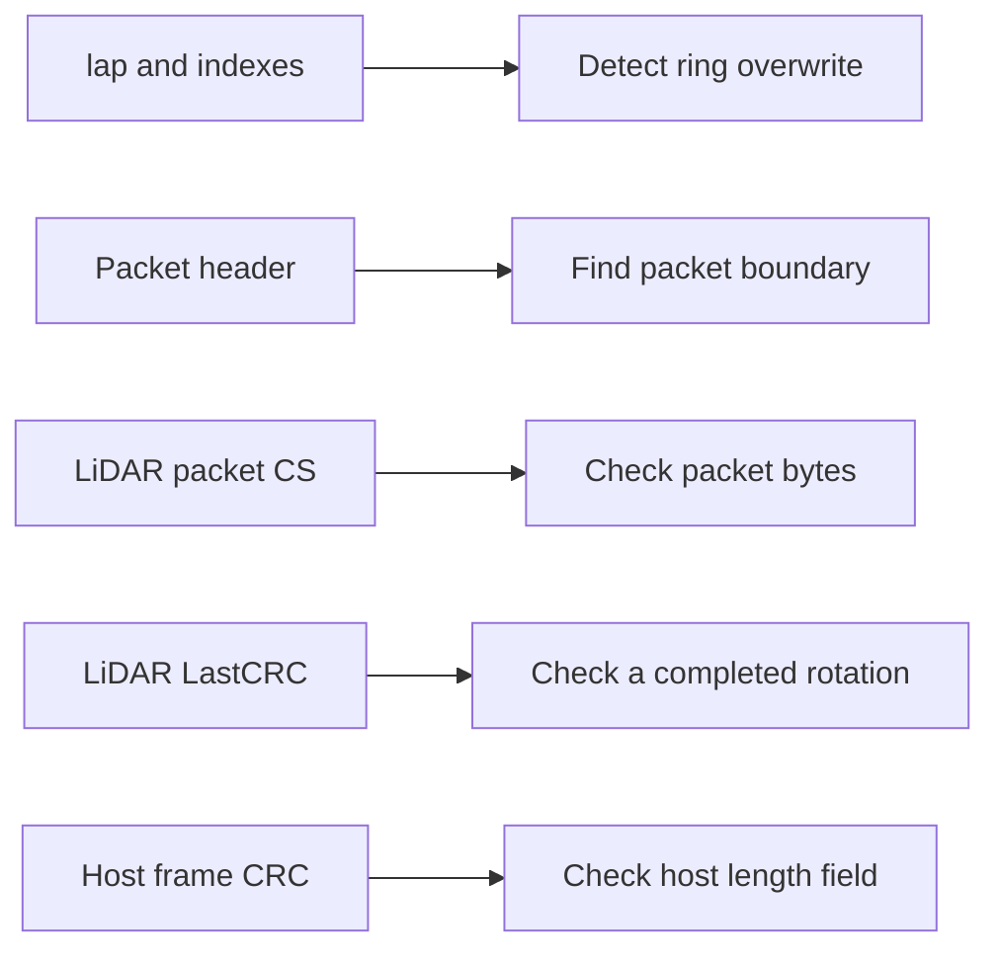

# Connection, Recovery, and Scan Data Flow

Startup uses blocking UART transfers. Scanning uses circular RX DMA and
software-started TX DMA.

TX slot ownership, queueing, and UART DMA dispatch are described in
[tx.md](tx.md).

## Connection and recovery

The host starts a session with a handshake. If a protocol error occurs during
startup or normal communication, both sides return to this stage.


```mermaid
flowchart TD
    power["Power on"] --> handshake["Handshake stage<br/>Host retries every 3 seconds until ACK"]
    handshake -- ACK received --> setup["Startup and UTC time sync<br/>Wait for host start command"]
    setup -- Start command --> active["Normal communication<br/>Sensor frames and motor commands"]
    setup -- Protocol error --> recover["Stop operation<br/>Discard old session data"]
    active -- Protocol error --> recover
    recover --> handshake
    reset["Soft reset command<br/>During handshake, startup, or normal communication"] --> stop["Stop operation"]
    stop --> reset_ack["Send SOFT RESET ACK<br/>Wait until UART transmission completes"]
    reset_ack --> restart["Restart controller"]
    restart --> handshake
```

```text
                       NORMAL COMMUNICATION
            +------+                            +------------+
            | Host | -- left/right motor Q6 --> | Controller |
            |      | <------ MOTOR ACK -------- |            |
            |      | <-- sensor/encoder data -- |            |
            +------+                            +------------+
                |                                      |
                +--------- protocol error -------------+
                                   |
                                   v
                         Stop current operation
                         Discard old session data
                                   |
                                   v
                          HANDSHAKE STAGE
            +------+                            +------------+
            | Host | -- handshake, every 3 s --> | Controller |
            |      | <----- handshake ACK ----- |            |
            +------+                            +------------+
                                   |
                                   v
                    Repeat startup and time sync
                    Wait for a new start command
```

- Handshake retries stop when the host receives the ACK. There is no periodic
  handshake during normal communication.
- A protocol error includes a failed UART transfer, an invalid startup reply,
  a malformed frame, an incomplete command after a receive timeout, or an
  invalid time sample.
- Recovery stops scanning and wheel motion, discards partial RX data and
  queued TX frames, and clears the current command and time-sync state.
- The controller waits for a new handshake. The host returns to its 3-second
  handshake retry loop when it detects failure or a missing expected reply.
- A new handshake ends any previous controller session before the ACK. This
  keeps both sides in the same stage even if a previous ACK was lost.
- Motor commands resume only after startup, time sync, and a new start command.
- Each accepted motor command receives `MOTOR ACK`. If the expected ACK is
  missing, the host returns to the handshake stage.
- Soft reset also returns to the handshake stage. The controller sends its
  reset ACK completely before restarting.

These are protocol requirements; the new firmware handlers and recovery path
are not implemented yet. The message bytes and startup order are defined in
[frame.md](frame.md#startup-sequence).

A LiDAR RX overrun uses the local recovery below. It does not restart the host
handshake when the stream parser can find a new valid packet.

## Motor command and ACK


```mermaid
flowchart TD
    command["Host sends left and right Q6 rotations"] --> validate{"Valid motor frame?"}
    validate -- No --> recover["Protocol recovery<br/>Return to handshake stage"]
    validate -- Yes --> accept["Controller accepts requested rotations"]
    accept --> ack["Controller sends MOTOR ACK"]
    ack --> host{"Host received ACK?"}
    host -- Yes --> active["Continue normal communication"]
    host -- Receive timeout --> recover
```

The ACK confirms command acceptance. Encoder reports show the measured wheel
rotations separately.

## Soft reset

```text
Host                        Controller
 | -- Soft reset AA A6 ------> |
 |                             | Stop scanning and wheel motion
 | <-- SOFT RESET ACK -------- |
 |                             | Wait for complete ACK transmission
 |                             | Restart and clear the old session
 | -- Handshake, every 3 s ---> |
 | <-- HANDSHAKE ACK ---------- |
 |                             |
 +---- Startup and time sync --+
 +---- New start command ------+
```

## Scan path


```mermaid
flowchart LR
    lidar["LiDAR byte stream"] --> rx_dma["RX DMA"]
    rx_dma --> rx_ring["4096-byte circular RX ring"]
    rx_ring --> free{"TX slot free?"}
    free -- No --> pause["Keep CPU read position"]
    pause --> free
    free -- Yes --> before{"DMA already passed reader?"}
    before -- Yes --> drop["Discard current RX data and any unsent frame<br/>Move reader to DMA position"]
    before -- No --> parse["Parse bytes and build one host frame"]
    parse --> after{"DMA passed reader while parsing?"}
    after -- Yes --> drop
    after -- No --> tx_queue["Five TX slots"]
    drop --> fresh["Wait for fresh bytes"]
    fresh --> free
    tx_queue --> tx_dma["TX DMA"]
    tx_dma --> host["Host"]
```

RX DMA continues while all TX slots are busy. The CPU read position stays
unchanged, so the next free-slot check can detect whether DMA passed it.

## RX ring positions

`write_idx` is the next DMA destination. `read_idx` is the next byte for the
CPU. The CPU never reads the current DMA destination.

```text
index       0                                             4095
            |-----------------------------------------------|
DMA         W -> next write
CPU                         R -> next read
```

`lap` is the number of DMA wraps that the reader has not crossed yet. DMA
increments it at the ring end. The reader decrements it when its index returns
to zero.

| `lap` | Index relation | Result |
| ---: | --- | --- |
| 0 | Any valid indexes | DMA has not passed the reader |
| 1 | `write_idx <= read_idx` | DMA has not passed the reader |
| 1 | `write_idx > read_idx` | DMA passed the reader |
| 2 or more | Any valid indexes | DMA passed the reader |


```mermaid
flowchart TD
    start["Read lap and indexes"] --> many{"lap > 1?"}
    many -- Yes --> passed["Overrun"]
    many -- No --> one{"lap == 1?"}
    one -- No --> safe["No overrun"]
    one -- Yes --> ahead{"write_idx > read_idx?"}
    ahead -- Yes --> passed
    ahead -- No --> safe
```

The indexes are signed values. This keeps `100 - 3500 = -3400` negative
after one DMA wrap instead of wrapping to a large unsigned value.

## Overrun recovery


```mermaid
flowchart LR
    detect["Detect overrun"] --> discard["Discard unread and partial data"]
    discard --> align["Set read position to current DMA position"]
    align --> wait["Wait for new bytes"]
    wait --> sync["Find the next valid packet"]
    sync --> resume["Resume frame conversion"]
```

Recovery starts from bytes that arrive after alignment. It does not wait for
another full ring wrap.

## Data checks


```mermaid
flowchart LR
    progress["lap and indexes"] --> overwrite["Detect ring overwrite"]
    marker["Packet header"] --> boundary["Find packet boundary"]
    cs["LiDAR packet CS"] --> packet["Check packet bytes"]
    lastcrc["LiDAR LastCRC"] --> rotation["Check a completed rotation"]
    hostcrc["Host frame CRC"] --> hostfield["Check host length field"]
```

The ring position detects overwritten bytes. A checksum cannot replace that
check. LiDAR packet `CS` and `LastCRC` are future checks. The current host
CRC covers only the two payload-length bytes.

## LiDAR-only throughput at 230400 bps

| Quantity | Calculation | Result |
| --- | ---: | ---: |
| LiDAR point rate | configured ranging rate | 4000 points/s |
| Host point payload | `4000 * 4` | 16000 bytes/s |
| UART capacity with 8N1 | `230400 / 10` | 23040 bytes/s |
| Remaining capacity | `23040 - 16000` | 7040 bytes/s |

At a 6 Hz scan rate, one rotation carries about 667 points. Its host
point payload is about 2667 bytes, while the UART can send 3840 bytes in the
same interval. This leaves about 1173 bytes for 10-byte host headers, or a
theoretical maximum of 117 LiDAR packets per rotation. Actual packet count and
TX queue occupancy must be measured before using this limit.

For TX queue capacity and lifecycle, see [tx.md](tx.md). For host commands and
frame fields, see [frame.md](frame.md).
