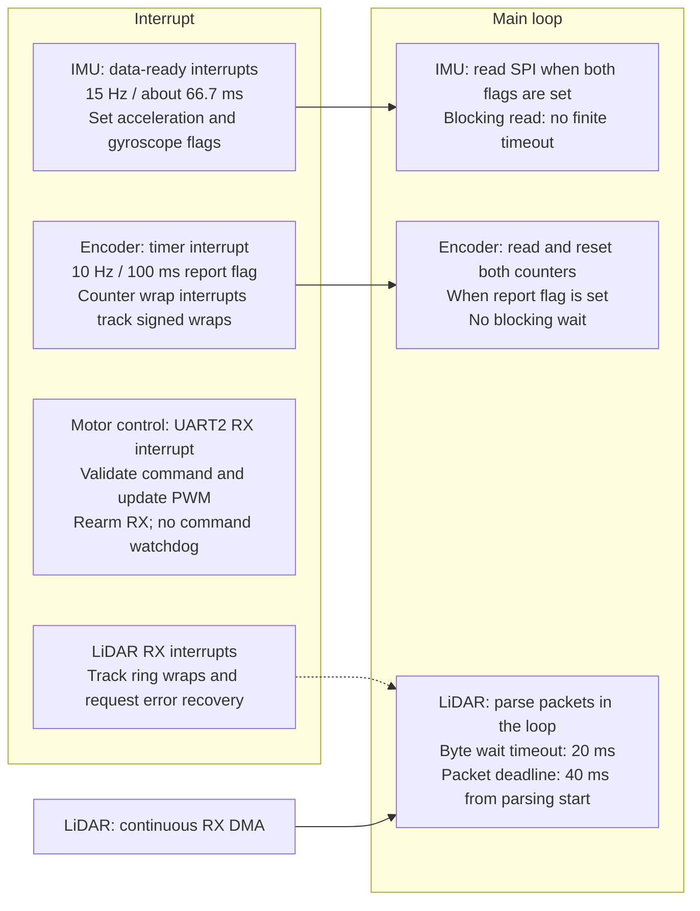

# Sensor Scheduling

```mermaid
flowchart LR
    subgraph interrupt["Interrupt"]
        imu_irq["IMU: data-ready interrupts<br/>15 Hz / about 66.7 ms<br/>Set acceleration and gyroscope flags"]
        encoder_irq["Encoder: timer interrupt<br/>10 Hz / 100 ms report flag<br/>Counter wrap interrupts track signed wraps"]
        motor_irq["Motor control: UART2 RX interrupt<br/>Validate command and update PWM<br/>Rearm RX; no command watchdog"]
        lidar_irq["LiDAR RX interrupts<br/>Track ring wraps and request error recovery"]
    end

    dma["LiDAR: continuous RX DMA"]

    subgraph main["Main loop"]
        imu["IMU: read SPI when both flags are set<br/>Blocking read: no finite timeout"]
        encoder["Encoder: read and reset both counters<br/>When report flag is set<br/>No blocking wait"]
        lidar["LiDAR: parse packets in the loop<br/>Byte wait timeout: 20 ms<br/>Packet deadline: 40 ms from parsing start"]
    end

    imu_irq --> imu
    encoder_irq --> encoder
    lidar_irq -.-> lidar
    dma --> lidar
```

Periods are nominal. LiDAR timeouts use the HAL tick.

Buffers and recovery: [Arbiter](arbiter.md). Wire formats: [Frame Format](frame.md).
