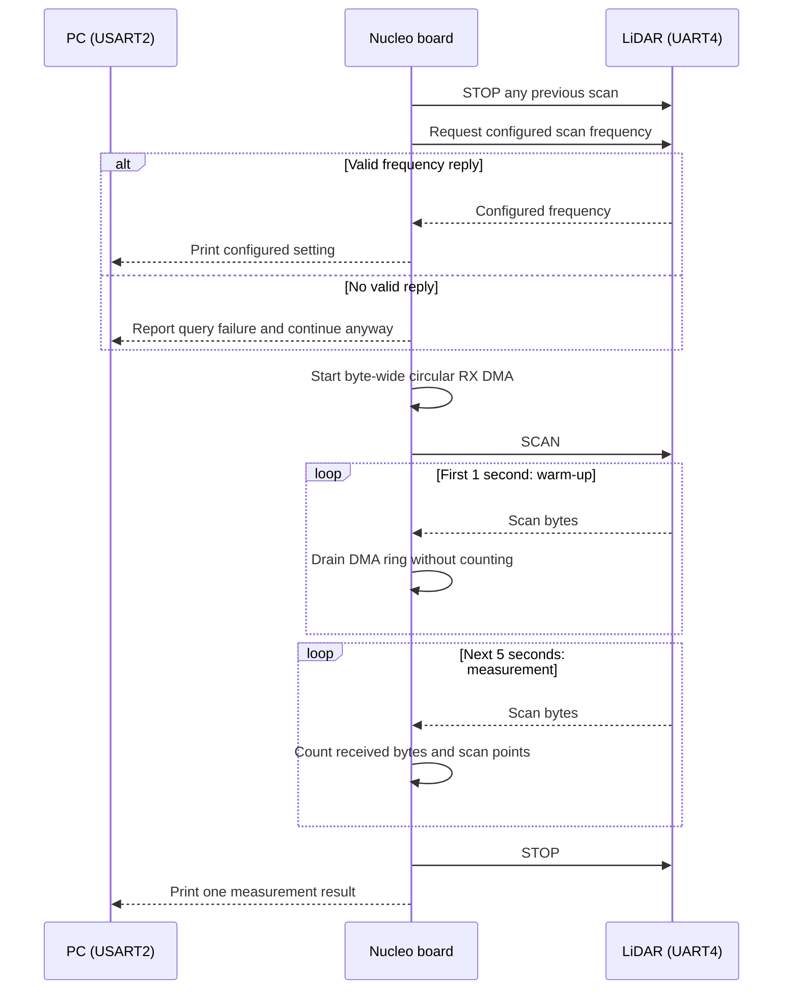
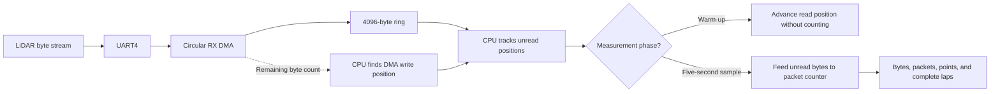
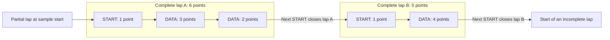

# LiDAR scan-rate probe

This temporary firmware mode measures the LiDAR stream at its **current** scan
frequency. It does not send a frequency-setting command. If the sensor still
uses its 6 Hz factory setting, the result describes that setting directly.

The probe uses UART4 at the firmware's configured 230400 bps for the LiDAR and
prints results on USART2 at 115200 bps. Connect to the board's USART2 serial
port, build and flash the probe, then reset the board:

```sh
cmake --preset Debug -DSENSOR_ECHO_LIDAR_RATE_PROBE=ON
cmake --build --preset Debug
```

## Measurement sequence



The frequency response is a configured setting, not a live speed measurement.
If the query fails, the five-second stream measurement still runs. The normal
startup loop runs only when the CMake option is off.

## How incoming bytes are counted



DMA writes positions `0 -> 1 -> ... -> 4095 -> 0` in the same array. The CPU
keeps a separate read position and follows the DMA write position. It drains
the ring during warm-up but starts its counters only for the five-second
sample. This temporary probe ring is independent of the two-slot RX design
described for the normal firmware.

```text
[SCAN PROBE] Configured scan frequency: 6.00 Hz.
[SCAN PROBE] OK bytes=... duration_ms=... bytes/s=... points/s=... points/lap=... ...
```

`bytes/s` counts the received UART stream, including packet headers.
`points/s` and `points/lap` use each scan packet's LSN and CT start-of-lap bit;
`points/lap` averages complete laps only. A `CHECK` result indicates a UART
error, malformed packet, fewer than two complete laps, or a polling gap that
could hide a DMA ring wrap. Packet XOR is not checked in this prototype.

## Which points belong to a complete lap?



`START` means CT bit 0 is set; its LSN is 1. `DATA` is a normal packet, and
the number is its LSN point count. The first START opens a lap. The next START
closes that lap and belongs to the new one. Points before the first START and
after the last START cannot form a complete lap in this sample, so they do not
enter `points/lap`. In this example, `laps=2`, `range=5..6`, and the integer
average is `points/lap=5`. Fully received packets still enter `points/s`.

Compare `bytes/s` and the RX buffer completion interval with the main loop's
worst-case processing time before deciding whether 6 Hz provides enough room.
Changing the LiDAR's rotation rate does not by itself prove that its bytes per
second change; this probe measures the actual stream. If the ranging rate stays
near 4000 points/s, expect roughly 667 points/lap at 6 Hz and at least 12,000
point-data bytes/s before packet headers. Those are estimates, not measured
results.

The packet counter can be checked on a host without the STM32 toolchain:

```sh
cc -std=c11 -Wall -Wextra -Werror -I. \
  experiments/lidar_rate_probe/scan_meter.c \
  experiments/lidar_rate_probe/scan_meter_test.c \
  -o /tmp/lidar_scan_meter_test
/tmp/lidar_scan_meter_test
```
