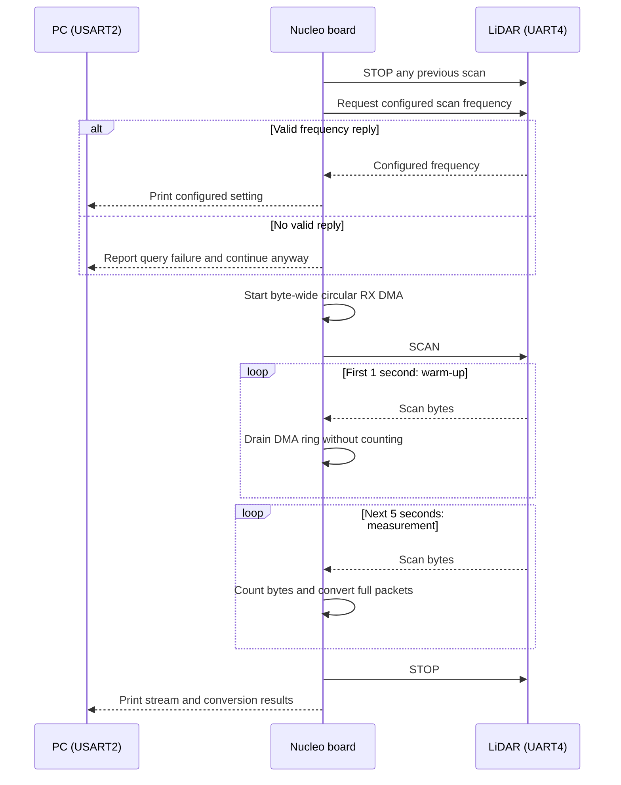
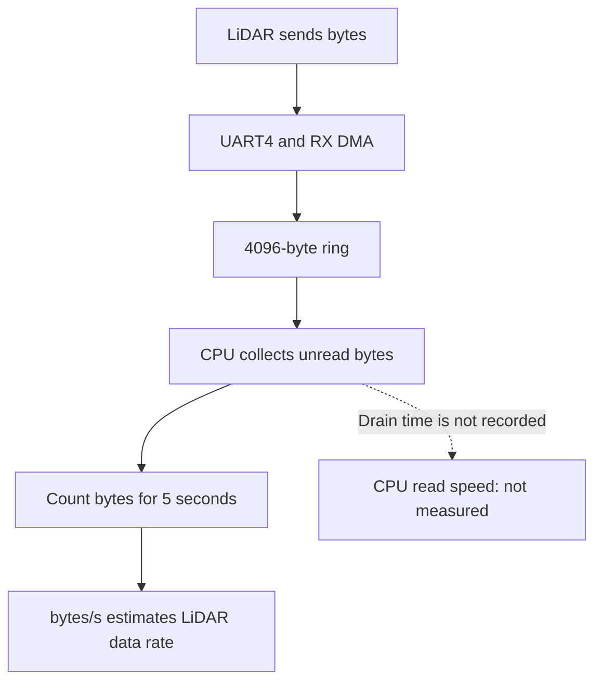
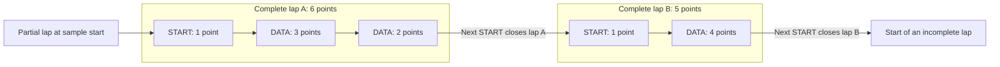

# LiDAR scan-rate probe

This temporary firmware mode measures the LiDAR stream and scan-frame conversion
at its **current** scan frequency. It does not change the scan frequency. If the
sensor still uses its 6 Hz factory setting, the result describes that setting.

The probe uses UART4 at the firmware's configured 230400 bps for the LiDAR and
prints results on USART2 at 115200 bps. Connect to the board's USART2 serial
port, build and flash the probe, then reset the board:

```sh
cmake --preset Debug -DSENSOR_ECHO_LIDAR_RATE_PROBE=ON
cmake --build --preset Debug
```

## Measurement sequence



The frequency response is a configured setting, not a live speed measurement.
If the query fails, the five-second stream measurement still runs. The normal
startup loop runs only when the CMake option is off.

## What the byte rate measures



DMA writes positions `0 -> 1 -> ... -> 4095 -> 0` in the same array. The CPU
follows with a separate read position. During warm-up it advances that position
without counting; during the sample it counts each byte it collects. The probe
divides that count by the sample duration to report `bytes/s`.

This estimates the LiDAR's delivered UART data rate **if no bytes are lost**.
It does not measure how fast the CPU can drain the ring. `max_poll_gap_ms`
records the longest time between polls, not the time spent reading the bytes.
An overwritten unread byte can make the reported rate too low; `CHECK` flags
some warning signs but cannot prove that every byte was collected. This
temporary ring is independent of the two-slot RX design described for the
normal firmware.

```text
[SCAN PROBE] Configured scan frequency: 6.00 Hz.
[SCAN PROBE] OK bytes=... duration_ms=... bytes/s=... points/s=... points/lap=... ...
[CONVERT PROBE] frames=... failed=... cycles/point=... max_frame_cycles=... max_frame_us=... max_unread=... core_hz=...
```

`bytes/s` counts UART bytes collected from the DMA ring, including packet
headers.
`points/s` and `points/lap` use each scan packet's LSN and CT start-of-lap bit;
`points/lap` averages complete laps only. A `CHECK` result indicates a UART
error, malformed packet, failed conversion, fewer than two complete laps, or a
polling gap that could hide a DMA ring wrap. Packet XOR is not checked in this
prototype.

## What the conversion numbers mean

After the scan command, the LiDAR sends one `A5 5A` response header, then an
ongoing stream of `AA 55` scan packets. The probe skips that response header
and measures conversion of each complete content packet.

The probe saves one complete LiDAR packet, then uses the same scan parser and PC
header writer as normal TX code. It reads each point, writes a PC frame into a
scratch buffer, and adds the 10-byte PC header. The next packet
overwrites that buffer. The probe does **not** send these PC frames.

The STM32 cycle counter measures each conversion call. `cycles/point` is all
successful conversion cycles divided by all converted points. It includes the
fixed work done once per packet. `max_frame_cycles` is the longest single
conversion; `max_frame_us` shows the same time in microseconds. Interrupts may
run during a call, so the count is elapsed core cycles, not only conversion
instructions. `frames` counts successful conversions and `failed` counts packets
that could not be converted.

`max_unread` is the most unread bytes seen when the CPU checked the 4096-byte DMA
ring. It helps spot a growing backlog, but a full ring wrap can still hide
lost bytes. This probe does not send PC frames by TX DMA, so it cannot measure
the full RX-to-PC pipeline or prove that the normal two-slot RX design meets
its deadline.

## Which points belong to a complete lap?



`START` means CT bit 0 is set; its LSN is 1. `DATA` is a normal packet, and
the number is its LSN point count. The first START opens a lap. The next START
closes that lap and belongs to the new one. Points before the first START and
after the last START cannot form a complete lap in this sample, so they do not
enter `points/lap`. In this example, `laps=2`, `range=5..6`, and the integer
average is `points/lap=5`. Fully received packets still enter `points/s`.

Compare `bytes/s` and the RX buffer completion interval with the main loop's
worst-case processing time before deciding whether 6 Hz provides enough room.
Changing the LiDAR's rotation rate does not by itself prove that its bytes per
second change; this probe measures the actual stream. If the ranging rate stays
near 4000 points/s, expect roughly 667 points/lap at 6 Hz and at least 12,000
point-data bytes/s before packet headers. Those are estimates, not measured
results.

The packet counter can be checked on a host without the STM32 toolchain:

```sh
cc -std=c11 -Wall -Wextra -Werror -I. -Isrc \
  experiments/lidar_rate_probe/scan_meter.c \
  experiments/lidar_rate_probe/scan_meter_test.c \
  -o /tmp/lidar_scan_meter_test
/tmp/lidar_scan_meter_test
```

The scan payload and PC header can be checked on a host too:

```sh
cc -std=c11 -Wall -Wextra -Werror \
  -I. -Isrc -Ilib/libcrc-2.0/include \
  experiments/lidar_rate_probe/scan_meter.c \
  src/lidar/parser.c src/tx/scan.c src/tx/header.c src/tx/frame.c \
  lib/libcrc-2.0/src/crc8.c \
  experiments/lidar_rate_probe/scan_conversion_test.c \
  -o /tmp/lidar_scan_conversion_test
/tmp/lidar_scan_conversion_test
```
